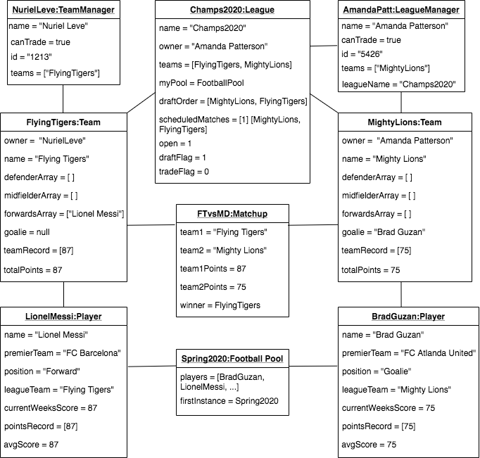
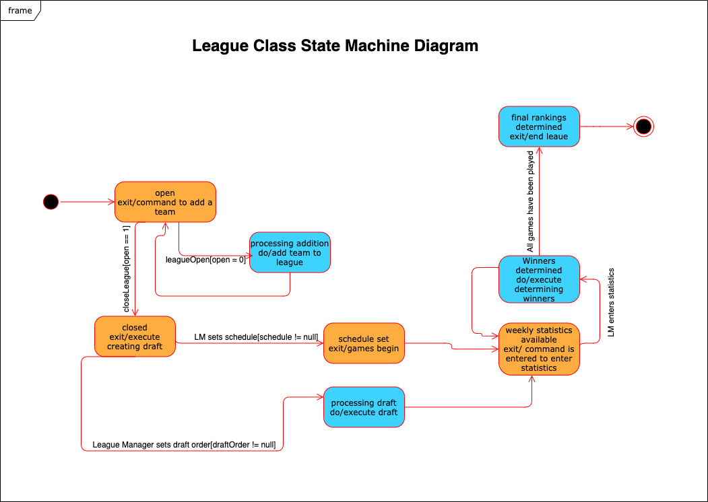
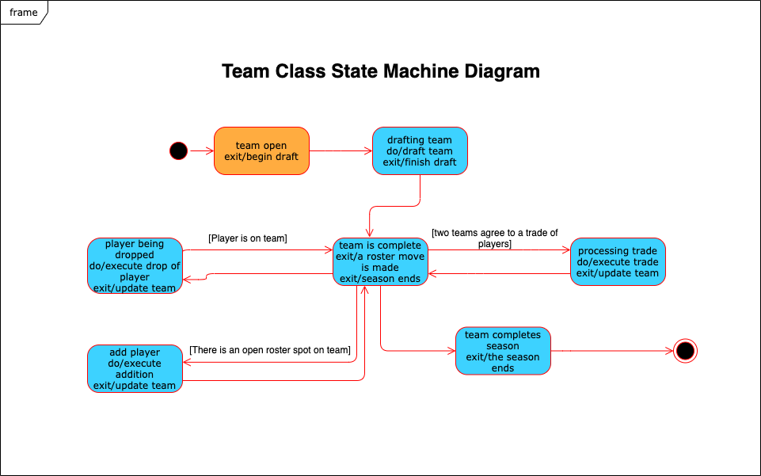
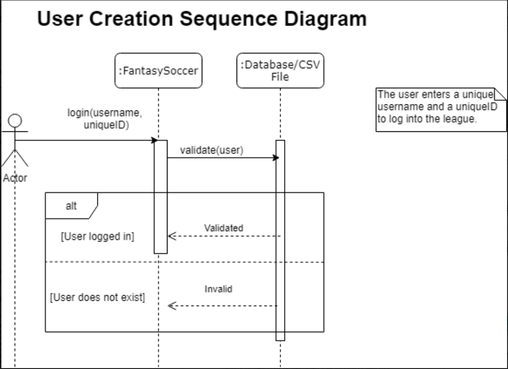
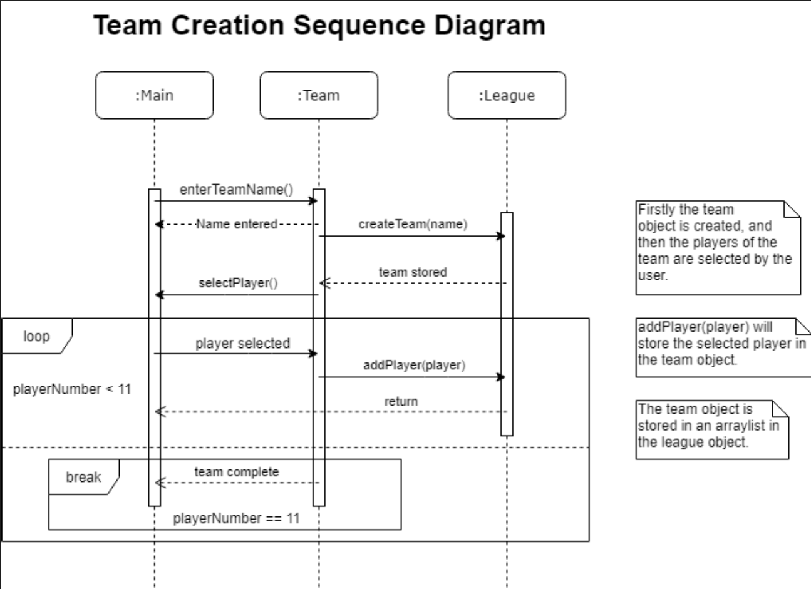

# Assignment 2
Maximum number of words for this document: 12000

**IMPORTANT**: In this assignment you will model the whole system. Within each of your models, you will have a *prescriptive intent* when representing the elements related to the feature you are implementing in this assignment, whereas the rest of the elements are used with a *descriptive intent*. In all your diagrams it is strongly suggested to used different colors for the prescriptive and descriptive parts of your models (this helps you in better reasoning on the level of detail needed in each part of the models and the instructors in knowing how to assess your models).   

**Format**: establish formatting conventions when describing your models in this document. For example, you style the name of each class in bold, whereas the attributes, operations, and associations as underlined text, objects are in italic, etc.

### Implemented feature

| ID  | Short name  | Description  |
|---|---|---|
| F1  | League Commands | The user can create and open/close the league to teams, set the schedule, and add statistics by issuing command-line commands with the following syntax: **Note that these are only open to the league manager**   command-name [target-objects]*. The available command-names are the following:   create: ... close: ...  open: …  setDraftOrder: …  setSchedule: ... randomSchedule: …   addStatistics: … | 

Please note that we have since updated the F1. You can see our updated functional requirements in the assignment1 document on this branch. We implemented the scope of what was described in our original F1. 

### Used modeling tool
Draw.io

## Class diagram									
Author(s): Lucy, Nuriel, Amanda, Dominic 

Classes: 
**User**: 
The user class is an abstract class that represents a user of our system. The user is someone who wants to compete in a Fantasy Soccer league. As it is abstract it can’t be implemented directly, it’s children are LeagueManager and TeamManager

Attributes: 
*name*: This attribute is the name of the user. It’s a string and the user may define it. This is a private attribute. 

*privateID*: This is the user’s privateID, it is essentially a password or pin. They use it to confirm their identity. This is a private attribute. 

*teams*: This is a list of all the teams that the user owns. It is an array of the names of the teams. Most users will elect to only have one team, but the option to have more than one is open. This is a private attribute. 

Operations: 
*getName()*: This returns the user’s name. Simple getter method.

*setName()*: This sets the user’s name.  

*getPrivateID()*: This returns the user’s privateID.  

*setPrivateID()*: This set the user’s privateID. 

*dropPlayer()*: This removes the specified player from the team associated with the user.

*draftPlayer()*: This adds the specified player to the team of the user. It will also check that the makeup of the team is still valid (correct number of forwards, goalies, etc.) and that the player is free to be drafted. 

*tradePlayer()*: This proposes a trade of two players. The first player specified is the one that the user is hoping to give away and the second is the one that the user is hoping to gain, but is currently on someone else’s team. The owner of the other team would have to approve the trade for it to go through. 

*createNewTeam()*: This allows the user to create a new team. It would be added to their list of teams.   

Associations: 
This class is the parent class of TeamManager and LeagueManager. There is an inheritance relationship between them.  
 

**LeagueManager**: 
The **LeagueManager** is the user that creates the league and runs the league. There can only be one **LeagueManager**. They have the ability to open/close the league, set and start the draft, add player statistics and confirm the schedule. It is the child of user so it inherits all of its attributes.   

Attributes: 
8leagueName*: This is the name of the league that the league manager created. 

Operations: 
*getLeagueName()*: This returns the name leagueName. 

*close()*: This operation closes the league, meaning that no other teams can join at this point. 

*open()*: This does the opposite of close, it opens the league so that teams may join.

*addStatistics()*: This allows the league manager to input statistics for every player in the league. They input how many fantasy points they have earned for the week. This is stored in the player’s record. 

*setDraftOrder()*: The league manager inputs the order in which teams can select players in the draft.  

*scheduler()*: This creates the schedule for the league. The league manager must call this to initiate the schedule and then must confirm it.  

Associations: 
It is the child of user so there is an inheritance relationship. 

**LeagueManager** creates **League**. This association is 1 to 1. Each league manager must create exactly one league and each league must be created by said league manager. 

**LeagueManager** also owns one or more team. They would create the team and then run it, by selecting players, doing trades, etc.  

**League**:
This is the league class. This is what runs the fantasy soccer league. All the teams are held here and all of the information about the league.  

Attributes: 
*name*: This is the name of the league. 

*owner*: This is the name of the owner of the league, so the league manager. 

*teams*: this is a list of all of the teams that have joined the league. It is an arraylist of Team objects. 

*myPool*: This is a FootballPool object. It is the pool of free premier league soccer players. 

*draftOrder*: This holds the order that the teams will draft players in.  

*scheduledMatches*: This is the schedule of the matches to be played. It is a 2D array and has as many columns as teams and rows as weeks in the season. Each index has a team and the first and second teams have a game, third and fourth, and so on.  

*open*: This is a flag that determines whether a league is open or closed. 1 for open, 0 for closed.  

Operations: 
*open()*: This opens the league by changing the open flag. 

*close()*: This closes the league.  

*getName()*: This returns the league name. 

*setName()*: This sets the league’s name. 

*getOwner()*: This returns the owner of the league, the league manager. 

*getPool()*: This returns the **FootballPool** object, myPool. 

*getTeams()*: This returns the arraylist teams. 

*getDraftOrder()*: This returns draftOrder.

*setDraftOrder()*: This sets draftOrder. 

*getScheduledMatches()8: This returns the schedule of the matches. 

*setSchedule()*: This sets scheduledMatches. 

Associations: 
**League** has a composition association with **Team**. A team is part of a league and cannot exist without the league. For every league there must be 0 to 16 teams and a team must be in exactly one league. Teams are held in the arraylist teams.  

**League** has a composition association with **FootballPool**. This is a one-to-one relationship. Each league must have exactly one football pool and a football pool must be a part of exactly one league.    

League has an association with **MatchUp**. The league runs the matchups. A league runs one to many matchups, but a matchup can only exist within exactly one league. 
 

**Player**: 
A player is a soccer player in the premier league. This has all the information about said player, including their statistics and what local league team they are on.  

Attributes:  
*name*: This is the player’s real world name. 

*premierTeam*: This is the name of the premier league team that they play on. 

*position*: This is their position. Either ‘d’,’m’,’f’ or ‘g’ for defense, midfield, forward or goalie. 

*leagueTeam*: This is the name of the team they are on in the league, or it is the empty string if they are not yet drafted. 

*currentWeeksScore*: This is the number of fantasy points they earned in the most recent week.  

*pointsRecord*: This is the record of all the points they have earned week by week. 

*avgScore*: This is a derived attribute from pointsRecord. It gives their average score per week.  

Operations: 
*getName()*: Getter method that returns a name.

*getPremierTeam()*: Getter method that returns premierTeam.

*getPosition()*: Getter method that returns position.

*getLeagueTeam()*: Getter method that returns leagueTeam.

*setLeagueTeam()*: This sets leagueTeam for a player.  

*getPointsRecord()*: Getter method that returns pointsRecord.

*addPointsRecord()*: This adds a week of points onto pointsRecord.  

*isFree()*: Returns true if the player is not on a local league team. 

*updateAvgScore()*: This computes the average score from the points record.  

Associations: 
A **Player** has a composition relationship with **FootballPool**. A player is a part of a **FootballPool** and cannot exist if the pool doesn’t exist. For every pool there must be one or more players and each player must be in exactly one pool.  

A **Player** has a shared aggregation relationship with a team.  A team is a collection of players, but a player may exist even if the team was removed from the league. There must be 11 players on a team and a player may be on 1 or 0 teams. 

**Team**:
A team is a collection of player objects, which represents a soccer team. It also records relevant information on the team and players.

Attributes:
*owner*: this represents the user of the program who owns the team, the team manager. 
*name*: this is the name of the team.
*defenderArray*, *midfielderArray8*, and *forwardsArray* store the players in their respective positions.
*goalie*: this is a Player attribute which stores the goalie of the team.
*record*: this is an array list which stores the previous scores of the team.

Operations:
*getName()*: accessor method for the name attribute.
*getOwner()*: accessor method for the owner attribute.
*removePlayer()*: a method to remove a player from the team.
*addPlayer()*: a method to add a player to a team.
*getPlayers()*: an accessor method to access the players on a team.
*getRecord()*: an accessor method to access the record of a team.   

Associations: 
A **Team** has an association with **MatchUp**. A team competes in a matchup. It may compete in one or many matchups. For each **MatchUp** there are exactly two teams. 

**TeamManager**
**TeamManager** is a child class of **User**. It represents the users who create a team in our system in order to play fantasy soccer. They are all users except the LeagueManager.  

Operations: 
*joinLeague()*: This adds the user to the open league. 
*leaveLeague()*: This will remove the user and any of their teams from the league.  

Associations: 
**TeamManager** has an inheritance relationship with **User**. It is a child class of **User**. 
It also has an association with **Team**. A **TeamManager** owns a Team. They create the team and then have ownership over it. A **TeamManager** may have one or more teams. Each Team must have exactly one **TeamManager**. 
 
**FootballPool**:
**FootballPool** is a class that contains arrays of all of the available **Player** objects sorted by position.

Attributes: 
*defenders*: An ArrayList of **Player** objects that play defender in real life
*midfielders*: An ArrayList of **Player** objects that play midfield in real life
*forwards*: An ArrayList of **Player** objects that play forward in real life
*goalies*: An ArrayList of **Player** objects that play goalie in real life

Operations: 
*getDefenders()*: Accessor method for the defenders attribute
*getMidfielders()*: Accessor method for the midfielders attribute
*getForwards()*: Accessor method for the forwards attribute
*getGoalies()*: Accessor method for the goalies attribute
*addD()*: Adds a defender **Player** to the defenders attribute
*addM()*: Adds a midfielder **Player** to the defenders attribute
*addF()*: Adds a forward **Player** to the defenders attribute
*addG()*: Adds a goalie **Player** to the defenders attribute

Associations:
The ArrayLists are composed of many **Player** objects
 
 
**Matchup**
**Matchup** is a class that is used to pair two teams against each other to see which teams score the highest. Whichever team scores the highest wins the match. Matchups are played weekly until the season is over

Attributes:
*team1*: A string representing the name of the first team participating in the matchup
*team2*: A string representing the name of the second team participating in the matchup
*team1points*: An integer representing the score of the first team 
*team2points*: An integer representing the score of the second team 
*gamedate*: An integer representing the date of the matchup

Operations
*getDate()*: An accessor method to receive the date attribute
*calcPoints()*: An accessor method to calculate the score of the game and return it
*updateScores()*: A method used to update the scores of the game

Associations
The **League** class runs each **Matchup** each week.
**Teams** compete in **Matchups**

Maximum number of words for this section: 3000

## Object diagrams								
Author(s): `name of the team member(s) responsible for this section`

This chapter contains the description of a "snapshot" of the status of your system during its execution. 
This chapter is composed of a UML object diagram of your system, together with a textual description of its key elements.

  
This object diagram shows a snapshot of our system, where Amanda and I are users and have created our own team or league. In this diagram, NurielLeve is the team manager with the password, copot213, to log into Fantasy Soccer. Amanda is a league manager with the password, 542632. Nuriel has created a team, Flying Tigers, with 11 players, including Lionel Messi. After a couple games, the team score is 87 as the sum of all the players. Nuriel’s team joins the Champs league, where Amanda manages the schedule and sets up match ups with all the teams listed in the teamList object. One Matchup object represented is the game between Flying Tigers and Mighty Dragons. Flying Tigers won with 87 points while Mighty Dragons lost with 75 points. This will move Flying Tigers up in the Champs league’s schedule. In the object diagram, there is also a variable for Lionel Messi, from the Player class. He has the currentWeeksScore as 7 for his score for that specific week. Since he is on the Flying Tigers team, he is not free. His position variable is set to “Forward”, and the array of Lionel’s info has a list of his birthday and premier team he plays on in reality. With an association to the Football Pool class, the last figure representing the UML class diagram is the Spring2020 object. This contains an array of all the soccer players worldwide, which will let users look through to see which players they want on their team/who is free to add to the team. 

Maximum number of words for this section: 1000

## State machine diagrams									
Author(s): `Dominic`

Color Coding: Blue - Prescriptive, Orange - Descriptive

State Machine 1: League Class

Once the league is created, the league manager can then add up to 16 teams into the league. The league is kept open by the league manager until they decide that the teams or set. Once the teams are set, the league manager then closes the league not allowing any more teams to join the league. After that, the league will then either pass into the state of setting the schedule, or staging the draft if the order has been set. The order of these two states being completed does not matter. While in the schedule setting state the league manager calls the operation to create a schedule for all of the participating teams in the league. While in the drafting state, each team will take turns picking a player until they are all filled. After completing the draft and setting the schedule games can now be played. The league enters the cycle between the states of statistics becoming available for players, and winners being determined for each weekly match by the league manager entering the statistics. The league switches between these two states until all matches have been played. The league then enters its final state where the final standings between the teams can be viewed. After that the season has concluded and the league is over.

State Machine 2: Team Class

Once a team is created, the team manager then has to draft their team. After the team is drafted, throughout the season the team manager has the ability to make changes to their team through dropping, adding, or trading players. These operations are done when the team manager inputs the command for which type of move to make. When the team is in the dropping state, it removes the chosen player from the team. After a player is dropped, teams usually add a different player. In order for the team to enter the state of adding a player, there has to be an open spot in the right position for the player to fill. Once the team does enter the adding state, the chosen player is then added to the team. The last operation that can be performed is trading. In order for a trade to happen, two teams have to agree to the trade. Once a team has entered the trading state, the team removes the players being traded away and adds the new players being received. After performing one of these roster moves, the team then returns to an updated state with the new team waiting for the next move. The team then enters its final state once the season has concluded and roster moves can no longer be made. 

## Sequence diagrams									
Author(s): Lucy, Nuriel

This chapter contains the specification of at least 2 UML sequence diagrams of your system, together with a textual description of all its elements. Here you have to focus on specific situations you want to describe. For example, you can describe the interaction of player when performing a key part of the videogame, during a typical execution scenario, in a special case that may happen (e.g., an error situation), when finalizing a fantasy soccer game, etc.

For each sequence diagram you have to provide:
- a title representing the specific situation you want to describe;
- a figure representing the sequence diagram;
- a textual description of all its elements in a narrative manner (you do not need to structure your description into tables in this case). We expect a detailed description of all the interaction partners, their exchanged messages, and the fragments of interaction where they are involved. For each sequence diagram we expect a description of about 300-500 words.

The goal of your sequence diagrams is both descriptive and prescriptive, so put the needed level of detail here, finding the right trade-off between understandability of the models and their precision.

User Validation Sequence Diagram

This sequence diagram depicts the user validation method. The Main class interacts with database/csv file to receive, store and validate information about the users. In this diagram the user enters their username and unique ID, which is passed to the login method in the Main class. This method will pass the details to the database/csv, which contains the username/unique ID pairs. The validation is completed and checks whether the unique ID matches the username provided. The return message determines whether or not the details were valid (if they existed in the database/csv). At this point the diagram shows two alternatives - if the details were valid then the user is logged in and a ‘validated’ return message is sent back to the Main class, if not then the user does not exist. When the user is logged in, they have access to their teams in the league, if they are not logged in then they will either have to enter the correct unique ID or create a new user (this is not shown in the diagram).

Team Creation Sequence Diagram

The Main and Team class pass messages containing input from the user, such as the name of the team and the player selections. The team class also sends return messages to confirm the completion of player selection. The team and league class interact through the actual instantiation of the player and team objects, which are both stored in the league object. The league class interacts with the main class by returning there in the program flow when a the player is selected and added to the team.
The main class is the point where the user gives information about the team they want to create, this information is passed to the team class. Once the team name is entered, the team is created and stored in the league class. The league class then returns confirmation to the team class that the team has been created and stored. The team then calls the select player operation which will allow the user to select the players on their team.
In the program, users take it in turns to select players so that the distribution of players is fair. This is not shown in the diagram for simplicity, but the user would have to wait between picking their player so that other users could pick too. The diagram shows that the program enters a loop, which repeats the selection process until the player number is 11 (at which the team is complete). When a player is selected, the selected player is passed in a message to the league class, which adds the player to the team (instantiates it and adds it to the team list). The league class then returns a confirmation message so that the program can return to the main class and another player can be selected. When the player number in the team stored in league reaches 11, a return message denoting that the team is complete is sent and the loop is exited.

Maximum number of words for this section: 3000

## Implementation									
Author(s): Amanda

In this chapter you will describe the following aspects of your project:
- Strategy that you followed when moving from the UML models to the implementation code: When moving from the UML models to the implementation code, the first thing that I did was to create the classes. I went through the class diagram and created classes corresponding with what we had modelled. I added all the attributes we had identified. The first operations I implemented were the getter and setter methods that we had identified as necessary. I now had the structure of the system set up, classes were made and attributes were set and usable. I then started work on the league manager commands. We had determined in the class diagram a series of commands that the league manager needed. They needed to be able to open and close their league, as well as add statistics and set the schedule of matches. I translated these commands into code and then moved onto the league commands. Additionally, during this time I was utilizing the object diagram. That was exceedingly helpful in wrapping my head around the bigger picture of our system. When I was lost or unsure where to go next I could remind myself what a ‘snapshot’ of this system would look like. From the league commands I moved onto how the user would actually interact with the system. In the main class of the system I set up the structure for inputting commands and that if no league had been set up yet the system would guide the user through setting up the system. This was fairly straight forward as I had already made use of the UML models to set up the structure of the system. This was just the final step in making it accessible to the user. 
- Key solutions that you applied when implementing your system (for example, how you implemented the syntax highlighting feature of your code snippet manager, how you manage fantasy soccer matches, etc.): One of the key solutions I applied when implementing the system was the scheduling of matches. This was rather tricky as the system had to be able to schedule a season of matches for anywhere between two and sixteen teams. We had decided on a round robin style of matches, where every team plays every other team and the team with the best record ‘wins’ in the end. I researched a round robin scheduling algorithm and decided on a system where I had a temporary array of all of the teams. One week of matches would consist of the first and the last teams playing each other and then the second and second to last teams, and so on, until the middle two teams were matched. If there were an odd number of teams, the middle team had a bye for that week. Each ‘week’ all but the first team in the array were shifted down one spot and the last was bumped to the front. The teams were again matched in the manner described above. This continued until every team had played every other team. For n teams, this meant n-1 weeks of play, if n was even, and n weeks of play, if n was odd. 
- The main java class is located in software-design/src/main/java/Main.java
- The Jar file for directly executing your system is in the repo in the file SoftwareDesignIdeas.jar
- The video is in software-design/docs/video_small.mov. I tried many attempts to embed it, but I believe there was an issue with my settings. 

<video src="video_small.mov" width="320" height="200" controls preload></video>

IMPORTANT: remember that your implementation must be consistent with your UML models. Also, your implementation must run without the need from any other external software or tool. Failing to meet this requirement means 0 points for the implementation part of your project.

Maximum number of words for this section: 2000

## References

References, if needed.
