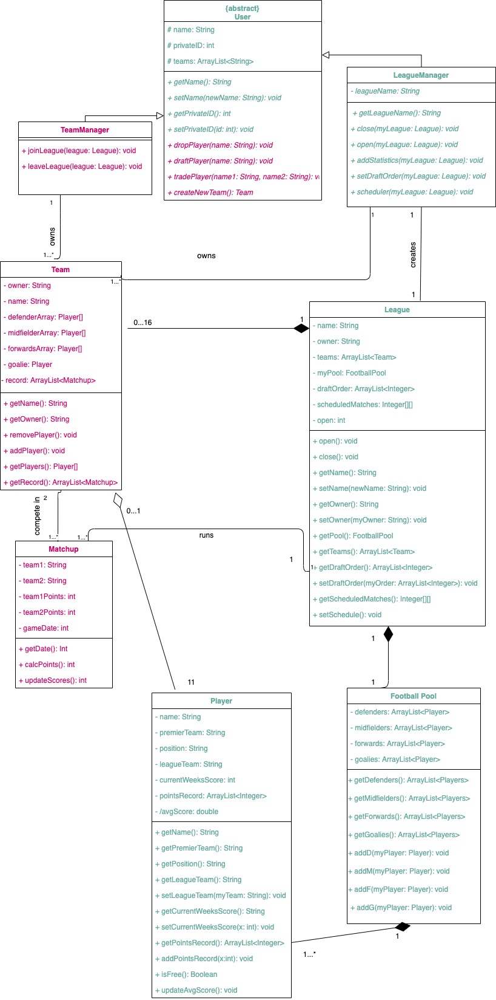

# Assignment 2
Maximum number of words for this document: 12000

**IMPORTANT**: In this assignment you will model the whole system. Within each of your models, you will have a *prescriptive intent* when representing the elements related to the feature you are implementing in this assignment, whereas the rest of the elements are used with a *descriptive intent*. In all your diagrams it is strongly suggested to used different colors for the prescriptive and descriptive parts of your models (this helps you in better reasoning on the level of detail needed in each part of the models and the instructors in knowing how to assess your models).   

**Format**: establish formatting conventions when describing your models in this document. For example, you style the name of each class in bold, whereas the attributes, operations, and associations as underlined text, objects are in italic, etc.

### Implemented feature

| ID  | Short name  | Description  |
|---|---|---|
| F1  | League Commands | The user can create and open/close the league to teams, set the schedule, and add statistics by issuing command-line commands with the following syntax: **Note that these are only open to the league manager**   command-name [target-objects]*. The available command-names are the following:   create: ... close: ...  open: …  setDraftOrder: …  setSchedule: ... randomSchedule: …   addStatistics: … | 

Please note that we have since updated the F1. You can see our updated functional requirements in the assignment1 document on this branch. We implemented the scope of what was described in our original F1. 

### Used modeling tool
Draw.io

## Class diagram									
Author(s): Lucy, Nuriel, Amanda, Dominic 

Author: Amanda 

For each class (and data type) in the class diagram you have to provide a paragraph providing the following information:
- Brief description about what it represents
- Brief description of the meaning of each attribute
- Brief description of the meaning of each operation
- Brief description of the meaning of each association involving it (each association can be described only once in this deliverable)

Maximum number of words for this section: 3000

## Object diagrams								
Author(s): `name of the team member(s) responsible for this section`

This chapter contains the description of a "snapshot" of the status of your system during its execution. 
This chapter is composed of a UML object diagram of your system, together with a textual description of its key elements.

`Figure representing the UML class diagram`
  
`Textual description`

Maximum number of words for this section: 1000

## State machine diagrams									
Author(s): `name of the team member(s) responsible for this section`

This chapter contains the specification of at least 2 UML state machines of your system, together with a textual description of all their elements. Also, remember that classes the describe only data structures (e.g., Coordinate, Position) do not need to have an associated state machine since they can be seen as simple "data containers" without behaviour (they have only stateless objects).

For each state machine you have to provide:
- the name of the class for which you are representing the internal behavior;
- a figure representing the part of state machine;
- a textual description of all its states, transitions, activities, etc. in a narrative manner (you do not need to structure your description into tables in this case). We expect 3-4 lines of text for describing trivial or very simple state machines (e.g., those with one to three states), whereas you will provide longer descriptions (e.g., ~500 words) when describing more complex state machines.

The goal of your state machine diagrams is both descriptive and prescriptive, so put the needed level of detail here, finding the right trade-off between understandability of the models and their precision.

Maximum number of words for this section: 3000

## Sequence diagrams									
Author(s): `name of the team member(s) responsible for this section`

This chapter contains the specification of at least 2 UML sequence diagrams of your system, together with a textual description of all its elements. Here you have to focus on specific situations you want to describe. For example, you can describe the interaction of player when performing a key part of the videogame, during a typical execution scenario, in a special case that may happen (e.g., an error situation), when finalizing a fantasy soccer game, etc.

For each sequence diagram you have to provide:
- a title representing the specific situation you want to describe;
- a figure representing the sequence diagram;
- a textual description of all its elements in a narrative manner (you do not need to structure your description into tables in this case). We expect a detailed description of all the interaction partners, their exchanged messages, and the fragments of interaction where they are involved. For each sequence diagram we expect a description of about 300-500 words.

The goal of your sequence diagrams is both descriptive and prescriptive, so put the needed level of detail here, finding the right trade-off between understandability of the models and their precision.

Maximum number of words for this section: 3000

## Implementation									
Author(s): `name of the team member(s) responsible for this section`

In this chapter you will describe the following aspects of your project:
- Strategy that you followed when moving from the UML models to the implementation code: When moving from the UML models to the implementation code, the first thing that I did was to create the classes. I went through the class diagram and created classes corresponding with what we had modelled. I added all the attributes we had identified. The first operations I implemented were the getter and setter methods that we had identified as necessary. I now had the structure of the system set up, classes were made and attributes were set and usable. I then started work on the league manager commands. We had determined in the class diagram a series of commands that the league manager needed. They needed to be able to open and close their league, as well as add statistics and set the schedule of matches. I translated these commands into code and then moved onto the league commands. Additionally, during this time I was utilizing the object diagram. That was exceedingly helpful in wrapping my head around the bigger picture of our system. When I was lost or unsure where to go next I could remind myself what a ‘snapshot’ of this system would look like. From the league commands I moved onto how the user would actually interact with the system. In the main class of the system I set up the structure for inputting commands and that if no league had been set up yet the system would guide the user through setting up the system. This was fairly straight forward as I had already made use of the UML models to set up the structure of the system. This was just the final step in making it accessible to the user. 
- Key solutions that you applied when implementing your system (for example, how you implemented the syntax highlighting feature of your code snippet manager, how you manage fantasy soccer matches, etc.): One of the key solutions I applied when implementing the system was the scheduling of matches. This was rather tricky as the system had to be able to schedule a season of matches for anywhere between two and sixteen teams. We had decided on a round robin style of matches, where every team plays every other team and the team with the best record ‘wins’ in the end. I researched a round robin scheduling algorithm and decided on a system where I had a temporary array of all of the teams. One week of matches would consist of the first and the last teams playing each other and then the second and second to last teams, and so on, until the middle two teams were matched. If there were an odd number of teams, the middle team had a bye for that week. Each ‘week’ all but the first team in the array were shifted down one spot and the last was bumped to the front. The teams were again matched in the manner described above. This continued until every team had played every other team. For n teams, this meant n-1 weeks of play, if n was even, and n weeks of play, if n was odd. 
- The main java class is located in software-design/src/main/java/Main.java
- The Jar file for directly executing your system is in the repo in the file SoftwareDesignIdeas.jar

<video src="video_small.mov" width="320" height="200" controls preload></video>

IMPORTANT: remember that your implementation must be consistent with your UML models. Also, your implementation must run without the need from any other external software or tool. Failing to meet this requirement means 0 points for the implementation part of your project.

Maximum number of words for this section: 2000

## References

References, if needed.
