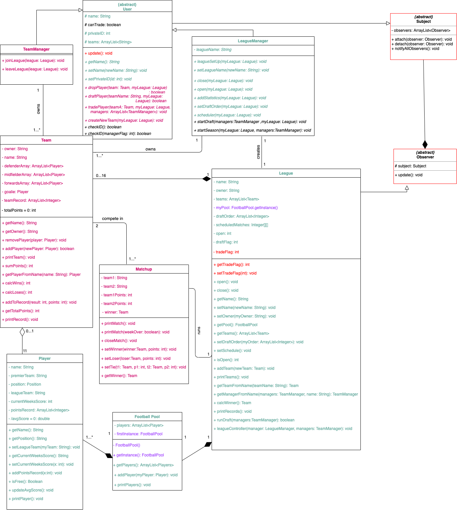
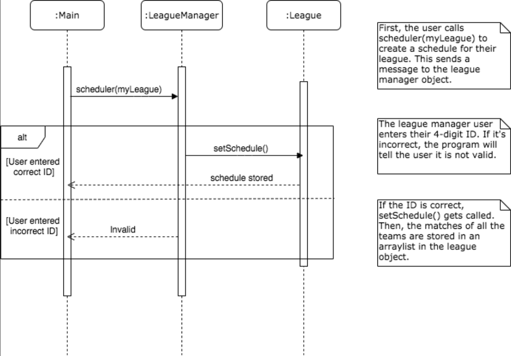

# Assignment 3

Maximum number of words for this document: 18000

**IMPORTANT**: In this assignment you will fully model and impement your system. The idea is that you improve your UML models and Java implementation by (i) applying (a subset of) the studied design patterns and (ii) adding any relevant implementation-specific details (e.g., classes with “technical purposes” which are not part of the domain of the system). The goal here is to improve the system in terms of maintainability, readability, evolvability, etc.    

**Format**: establish formatting conventions when describing your models in this document. For example, you style the name of each class in bold, whereas the attributes, operations, and associations as underlined text, objects are in italic, etc.

## Summary of Changes of Assignment 2
Author(s): Amanda, Nuriel, Lucy, Dominic

Provide a bullet list summarizing all the changes you performed in Assignment 2 for addressing our feedback.

**Sequence Diagrams**
+ Updated the first diagram so that the user has a lifeline.
+ Updated the second diagram to add a break to the loop.
 
**Implementation**
+ Changed user class to be abstract (error from assignment 2)
+ Created one arraylist with all the players in football pool, as opposed to having different arraylists for different positions
+ Pulled out repeated code and consolidated it into functions
+ Completed implementation

Maximum number of words for this section: 1000

## Application of Design Patterns
Author(s): Nuriel, Amanda

`Figure representing the UML class diagram. We found it most clear to color code the design patterns as some did not require the creation of a new class- simply new methods. Everything pertaining to DP1 is highlighted in PURPLE. Everything pertaining to DP2 is highlighted in RED. `

For each application of any design pattern you have to provide a table conforming to the template below.

| ID  | DP1  |
|---|---|
| **Design Pattern**  | Singleton |
| **Problem**  | In our fantasy football system, team and league managers will be able to create their own team, selecting 11 members from a list of premier players. This list will contain all the official football players in the world with their stats. There can only be one instance of this pool because each player can only exist once in the list. If there were multiple objects of the premier player pool, team and league managers will be able to select the same players from the different instances of the pool. That means one user could select Lionel Messi from PremierPlayerPool1 while another could select him from PremierPlayerPool2. |
| **Solution**  | We will use the singleton design pattern to create only one instance of the premier player pool. This will solve our issue because the team and league managers will only be able to add one specific player from the premier player list. This will control the access to the pool, giving all the users the ability to view all the players’ stats and add them to their team without creating multiple instances of those players.  With the premier player list as a single object, all the football players and the pool itself will be public for the users to look at and go through. This will assist our system to make it run smoothly and prevent information leakage to occur in our program. Moreover, we won’t have to worry about multiple player and pool objects occurring within the system. |
| **Intended use**  | The object, premier football pool, will be used when a user wants to create/edit/redo their team. For example, let’s say a user is logged into their account and wants to add some of the players onto their already existing team. Using a method in the main class, the team manager gets access to the pool object and can view the players’ stats. They can loop through each player in the list by calling the iterator, which will send the player’s information to the user. At last, when the user wants to add that player to their team, they call the addPlayer() method to store that selected player into their team object. While multiple users have access and can view the pool at the same time, only a single premier player pool object exists in the system. |
| **Constraints**  |  |
| **Additional remarks**  |  |

| ID  | DP2  |
|---|---|
| **Design Pattern**  | Observer |
| **Problem**  | Our problem was that once a week the ability to trade, draft, and drop players was 'turned on' within the league. The rest of the time this functionality was not available to users. We needed to league to signal to the user class that this time had started. The user class hearing this could 'activate' its trade, drop, and draft function, that it otherwise would not be allowed to use.  |
| **Solution**  | We solved this by implementing the Observer design pattern. We created an abstract Subject class and an abstract Observer class. League extends subject and User extends observer. It is the state change in league that triggers a response from user through the implementation of the observer pattern. When the league changes its state, User is notified, and the trading, dropping and drafting functionality is available.  |
| **Intended use**  | The league class notifies the user class every time its 'trading state' changes. This means that when it hits the time of the week that it alloted for trading, it notifies User. This way User can interally turn on and off the 'blocking mechanism' for its functions. In this case it is a simple boolean that switches. When the league is not in trading mode the functionality in user is not allowed and when the league changes to trading mode, it signals this to user and user allows this functionality. |
| **Constraints**  |  |
| **Additional remarks**  | We recognize that this design pattern is especially helpful when many classes have actions triggered by a state change in another. At this point in time the only observer in our system is the User class, however, by implementing the observer design pattern here we have made the system much more extensible. This state change, the trading period, triggers a period where more functionality is available to users, so if more functionality were to be added it would also likely be dependent on this state change. For this reason we have added the observer design pattern into our system, even though with the current functionality it only has a neutral impact. We are weary of creating too general a system, but we believed this was a small addition that could have great future rewards." |

Maximum number of words for this section: 2000

## Class Diagram									
Author(s): Lucy, Nuriel, Amanda, Dominic 

This diagram is color-coded. Everything pertaining to DP1 is highlighted in PURPLE. Everything pertaining to DP2 is highlighted in RED. Everything implemented for Assignment2 is in green. Pink is everything that was implemented for this assignment and originally modelled in our system. Black is changes from the original modelling that we implemented.

### User 
The user class is an abstract class that represents a user of our system. The user is someone who wants to compete in a Fantasy Soccer league. As it is abstract it can’t be implemented directly, it’s children are LeagueManager and TeamManager

Attributes: 

+ *name*: This attribute is the name of the user. It’s a string and the user may define it. This is a private attribute. 

+ *privateID*: This is the user’s privateID, it is essentially a password or pin. They use it to confirm their identity. This is a private attribute. 

+ *teams*: This is a list of all the teams that the user owns. It is an array of the names of the teams. Most users will elect to only have one team, but the option to have more than one is open. This is a private attribute. 

Operations: 

+ *getName()*: This returns the user’s name. Simple getter method.

+ *setName()*: This sets the user’s name.  

+ *getPrivateID()*: This returns the user’s privateID.  

+ *setPrivateID()*: This set the user’s privateID. 

+ *dropPlayer()*: This removes the specified player from the team associated with the user.

+ *draftPlayer()*: This adds the specified player to the team of the user. It will also check that the makeup of the team is still valid (correct number of forwards, goalies, etc.) and that the player is free to be drafted. 

+ *tradePlayer()*: This proposes a trade of two players. The first player specified is the one that the user is hoping to give away and the second is the one that the user is hoping to gain, but is currently on someone else’s team. The owner of the other team would have to approve the trade for it to go through. 

+ *createNewTeam()*: This allows the user to create a new team. It would be added to their list of teams.   

Associations: 

This class is the parent class of TeamManager and LeagueManager. There is an inheritance relationship between them.  
 

### LeagueManager 
The **LeagueManager** is the user that creates the league and runs the league. There can only be one **LeagueManager**. They have the ability to open/close the league, set and start the draft, add player statistics and confirm the schedule. It is the child of user so it inherits all of its attributes.   

Attributes: 

+ *leagueName*: This is the name of the league that the league manager created. 

Operations: 

+ *getLeagueName()*: This returns the name leagueName. 

+ *close()*: This operation closes the league, meaning that no other teams can join at this point. 

+ *open()*: This does the opposite of close, it opens the league so that teams may join.

+ *addStatistics()*: This allows the league manager to input statistics for every player in the league. They input how many fantasy points they have earned for the week. This is stored in the player’s record. 

+ *setDraftOrder()*: The league manager inputs the order in which teams can select players in the draft.  

+ *scheduler()*: This creates the schedule for the league. The league manager must call this to initiate the schedule and then must confirm it.  

Associations:

It is the child of user so there is an inheritance relationship. 

**LeagueManager** creates **League**. This association is 1 to 1. Each league manager must create exactly one league and each league must be created by said league manager. 

**LeagueManager** also owns one or more team. They would create the team and then run it, by selecting players, doing trades, etc.  

### League
This is the league class. This is what runs the fantasy soccer league. All the teams are held here and all of the information about the league.  

Attributes: 

+ *name*: This is the name of the league. 

+ *owner*: This is the name of the owner of the league, so the league manager. 

+ *teams*: this is a list of all of the teams that have joined the league. It is an arraylist of Team objects. 

+ *myPool*: This is a FootballPool object. It is the pool of free premier league soccer players. 

+ *draftOrder*: This holds the order that the teams will draft players in.  

+ *scheduledMatches*: This is the schedule of the matches to be played. It is a 2D array and has as many columns as teams and rows as weeks in the season. Each index has a team and the first and second teams have a game, third and fourth, and so on.  

+ *open*: This is a flag that determines whether a league is open or closed. 1 for open, 0 for closed.  

Operations: 

+ *open()*: This opens the league by changing the open flag. 

+ *close()*: This closes the league.  

+ *getName()*: This returns the league name. 

+ *setName()*: This sets the league’s name. 

+ *getOwner()*: This returns the owner of the league, the league manager. 

+ *getPool()*: This returns the **FootballPool** object, myPool. 

+ *getTeams()*: This returns the arraylist teams. 

+ *getDraftOrder()*: This returns draftOrder.

+ *setDraftOrder()*: This sets draftOrder. 

+ *getScheduledMatches()*: This returns the schedule of the matches. 

+ *setSchedule()*: This sets scheduledMatches. 

Associations: 

**League** has a composition association with **Team**. A team is part of a league and cannot exist without the league. For every league there must be 0 to 16 teams and a team must be in exactly one league. Teams are held in the arraylist teams.  

**League** has a composition association with **FootballPool**. This is a one-to-one relationship. Each league must have exactly one football pool and a football pool must be a part of exactly one league.    

League has an association with **MatchUp**. The league runs the matchups. A league runs one to many matchups, but a matchup can only exist within exactly one league. 

### Player 
A player is a soccer player in the premier league. This has all the information about said player, including their statistics and what local league team they are on.  

Attributes:  

+ *name*: This is the player’s real world name. 

+ *premierTeam*: This is the name of the premier league team that they play on. 

+ *position*: This is their position. Either ‘d’,’m’,’f’ or ‘g’ for defense, midfield, forward or goalie. 

+ *leagueTeam*: This is the name of the team they are on in the league, or it is the empty string if they are not yet drafted. 

+ *currentWeeksScore*: This is the number of fantasy points they earned in the most recent week.  

+ *pointsRecord*: This is the record of all the points they have earned week by week. 

+ *avgScore*: This is a derived attribute from pointsRecord. It gives their average score per week.  

Operations: 

+ *getName()*: Getter method that returns a name.

+ *getPremierTeam()*: Getter method that returns premierTeam.

+ *getPosition()*: Getter method that returns position.

+ *getLeagueTeam()*: Getter method that returns leagueTeam.

+ *setLeagueTeam()*: This sets leagueTeam for a player.  

+ *getPointsRecord()*: Getter method that returns pointsRecord.

+ *addPointsRecord()*: This adds a week of points onto pointsRecord.  

+ *isFree()*: Returns true if the player is not on a local league team. 

+ *updateAvgScore()*: This computes the average score from the points record.  

Associations: 

A **Player** has a composition relationship with **FootballPool**. A player is a part of a **FootballPool** and cannot exist if the pool doesn’t exist. For every pool there must be one or more players and each player must be in exactly one pool.  

A **Player** has a shared aggregation relationship with a team.  A team is a collection of players, but a player may exist even if the team was removed from the league. There must be 11 players on a team and a player may be on 1 or 0 teams. 

### Team
A team is a collection of player objects, which represents a soccer team. It also records relevant information on the team and players.

Attributes:

+ *owner*: this represents the user of the program who owns the team, the team manager. 

+ *name*: this is the name of the team.

+ *defenderArray*, *midfielderArray*, and *forwardsArray* store the players in their respective positions.

+ *goalie*: this is a Player attribute which stores the goalie of the team.

+ *record*: this is an array list which stores the previous scores of the team.

Operations:

+ *getName()*: accessor method for the name attribute.

+ *getOwner()*: accessor method for the owner attribute.

+ *removePlayer()*: a method to remove a player from the team.

+ *addPlayer()*: a method to add a player to a team.

+ *getPlayers()*: an accessor method to access the players on a team.

+ *getRecord()*: an accessor method to access the record of a team.  

Associations: 

A **Team** has an association with **MatchUp**. A team competes in a matchup. It may compete in one or many matchups. For each **MatchUp** there are exactly two teams. 

### TeamManager
**TeamManager** is a child class of **User**. It represents the users who create a team in our system in order to play fantasy soccer. They are all users except the LeagueManager.  

Operations: 

+ *joinLeague()*: This adds the user to the open league. 

+ *leaveLeague()*: This will remove the user and any of their teams from the league.  

Associations: 

**TeamManager** has an inheritance relationship with **User**. It is a child class of **User**. 
It also has an association with **Team**. A **TeamManager** owns a Team. They create the team and then have ownership over it. A **TeamManager** may have one or more teams. Each Team must have exactly one **TeamManager**. 
 
 
### FootballPool
**FootballPool** is a class that contains arrays of all of the available **Player** objects sorted by position.

Attributes: 

+ *defenders*: An ArrayList of **Player** objects that play defender in real life.

+ *midfielders*: An ArrayList of **Player** objects that play midfield in real life.

+ *forwards*: An ArrayList of **Player** objects that play forward in real life.

+ *goalies*: An ArrayList of **Player** objects that play goalie in real life.

Operations: 

+ *getDefenders()*: Accessor method for the defenders attribute.

+ *getMidfielders()*: Accessor method for the midfielders attribute.

+ *getForwards()*: Accessor method for the forwards attribute.

+ *getGoalies()*: Accessor method for the goalies attribute.

+ *addD()*: Adds a defender **Player** to the defenders attribute.

+ *addM()*: Adds a midfielder **Player** to the defenders attribute.

+ *addF()*: Adds a forward **Player** to the defenders attribute.

+ *addG()*: Adds a goalie **Player** to the defenders attribute.

Associations:

The ArrayLists are composed of many **Player** objects.
 
 
### Matchup
**Matchup** is a class that is used to pair two teams against each other to see which teams score the highest. Whichever team scores the highest wins the match. Matchups are played weekly until the season is over

Attributes:

+ *team1*: A string representing the name of the first team participating in the matchup 

+ *team2*: A string representing the name of the second team participating in the matchup 

+ *team1points*: An integer representing the score of the first team 

+ *team2points*: An integer representing the score of the second team 

+ *gamedate*: An integer representing the date of the matchup

Operations:

+ *getDate()*: An accessor method to receive the date attribute

+ *calcPoints()*: An accessor method to calculate the score of the game and return it

+ *updateScores()*: A method used to update the scores of the game

Associations:

The **League** class runs each **Matchup** each week.
**Teams** compete in **Matchups**

Maximum number of words for this section: 4000

## Object Diagram								
Author(s): `name of the team member(s) responsible for this section`

This chapter contains the description of a "snapshot" of the status of your system during its execution. 
This chapter is composed of a UML object diagram of your system, together with a textual description of its key elements.

`Figure representing the UML class diagram`
  
`Textual description`

Maximum number of words for this section: 1000

## State Machine Diagrams									
Author(s): `name of the team member(s) responsible for this section`

This chapter contains the specification of at least 2 UML state machines of your system, together with a textual description of all their elements. Also, remember that classes the describe only data structures (e.g., Coordinate, Position) do not need to have an associated state machine since they can be seen as simple "data containers" without behaviour (they have only stateless objects).

For each state machine you have to provide:
- the name of the class for which you are representing the internal behavior;
- a figure representing the part of state machine;
- a textual description of all its states, transitions, activities, etc. in a narrative manner (you do not need to structure your description into tables in this case). We expect 3-4 lines of text for describing trivial or very simple state machines (e.g., those with one to three states), whereas you will provide longer descriptions (e.g., ~500 words) when describing more complex state machines.

The goal of your state machine diagrams is both descriptive and prescriptive, so put the needed level of detail here, finding the right trade-off between understandability of the models and their precision.

Maximum number of words for this section: 4000

## Sequence Diagrams									
Author(s): Lucy, Nuriel

This chapter contains the specification of at least 2 UML sequence diagrams of your system, together with a textual description of all its elements. Here you have to focus on specific situations you want to describe. For example, you can describe the interaction of player when performing a key part of the videogame, during a typical execution scenario, in a special case that may happen (e.g., an error situation), when finalizing a fantasy soccer game, etc.

For each sequence diagram you have to provide:
- a title representing the specific situation you want to describe;
- a figure representing the sequence diagram;
- a textual description of all its elements in a narrative manner (you do not need to structure your description into tables in this case). We expect a detailed description of all the interaction partners, their exchanged messages, and the fragments of interaction where they are involved. For each sequence diagram we expect a description of about 300-500 words.

The goal of your sequence diagrams is both descriptive and prescriptive, so put the needed level of detail here, finding the right trade-off between understandability of the models and their precision.

**User Validation Sequence Diagram**

This sequence diagram depicts the user validation method. The Main class interacts with database/csv file to receive, store and validate information about the users. In this diagram the user enters their username and unique ID, which is passed to the login method in the Main class. This method will pass the details to the database/csv, which contains the username/unique ID pairs. The validation is completed and checks whether the unique ID matches the username provided. The return message determines whether or not the details were valid (if they existed in the database/csv). At this point the diagram shows two alternatives - if the details were valid then the user is logged in and a ‘validated’ return message is sent back to the Main class, if not then the user does not exist. When the user is logged in, they have access to their teams in the league, if they are not logged in then they will either have to enter the correct unique ID or create a new user (this is not shown in the diagram).

**Team Creation Sequence Diagram**

The Main and Team class pass messages containing input from the user, such as the name of the team and the player selections. The team class also sends return messages to confirm the completion of player selection. The team and league class interact through the actual instantiation of the player and team objects, which are both stored in the league object. The league class interacts with the main class by returning there in the program flow when a the player is selected and added to the team.
The main class is the point where the user gives information about the team they want to create, this information is passed to the team class. Once the team name is entered, the team is created and stored in the league class. The league class then returns confirmation to the team class that the team has been created and stored. The team then calls the select player operation which will allow the user to select the players on their team.
In the program, users take it in turns to select players so that the distribution of players is fair. This is not shown in the diagram for simplicity, but the user would have to wait between picking their player so that other users could pick too. The diagram shows that the program enters a loop, which repeats the selection process until the player number is 11 (at which the team is complete). When a player is selected, the selected player is passed in a message to the league class, which adds the player to the team (instantiates it and adds it to the team list). The league class then returns a confirmation message so that the program can return to the main class and another player can be selected. When the player number in the team stored in league reaches 11, a return message denoting that the team is complete is sent and the loop is exited.

**League Scheduler Sequence Diagram**

In creating a schedule for a league, the Main class first sends a message to the League manager, which will verify that the user is the league manager by asking for their 4-digit ID code. If the user enters their code correctly, they are verified as the league manager and the schedule is set. A reply message is sent back to the Main class to indicate the successful creation and storage of the league. If the user enters an incorrect ID code, then the Main class is notified by the LeagueManager class and the user is prompted to enter the correct code.

Maximum number of words for this section: 3000

## Implementation									
Author(s): Amanda

In this chapter you will describe the following aspects of your project:
- Strategy that you followed when moving from the UML models to the implementation code: When moving from the UML models to the implementation code, the first thing that I did was to create the classes. I went through the class diagram and created classes corresponding with what we had modelled. I added all the attributes we had identified. The first operations I implemented were the getter and setter methods that we had identified as necessary. I now had the structure of the system set up, classes were made and attributes were set and usable. I then started work on the league manager commands. We had determined in the class diagram a series of commands that the league manager needed. They needed to be able to open and close their league, as well as add statistics and set the schedule of matches. I translated these commands into code and then moved onto the league commands. Additionally, during this time I was utilizing the object diagram. That was exceedingly helpful in wrapping my head around the bigger picture of our system. When I was lost or unsure where to go next I could remind myself what a ‘snapshot’ of this system would look like. From the league commands I moved onto how the user would actually interact with the system. In the main class of the system I set up the structure for inputting commands and that if no league had been set up yet the system would guide the user through setting up the system. This was fairly straight forward as I had already made use of the UML models to set up the structure of the system. This was just the final step in making it accessible to the user. 
- Key solutions that you applied when implementing your system (for example, how you implemented the syntax highlighting feature of your code snippet manager, how you manage fantasy soccer matches, etc.): One of the key solutions I applied when implementing the system was the scheduling of matches. This was rather tricky as the system had to be able to schedule a season of matches for anywhere between two and sixteen teams. We had decided on a round robin style of matches, where every team plays every other team and the team with the best record ‘wins’ in the end. I researched a round robin scheduling algorithm and decided on a system where I had a temporary array of all of the teams. One week of matches would consist of the first and the last teams playing each other and then the second and second to last teams, and so on, until the middle two teams were matched. If there were an odd number of teams, the middle team had a bye for that week. Each ‘week’ all but the first team in the array were shifted down one spot and the last was bumped to the front. The teams were again matched in the manner described above. This continued until every team had played every other team. For n teams, this meant n-1 weeks of play, if n was even, and n weeks of play, if n was odd.  
-Another key solution was the implementation of the leagueController class. This class actually controlled how the league ran after all teams were created and drafted, and all primary steps were complete. This class would wait for a week (4 seconds for testing purposes) and it would then prompt the league manager to input statistics and create and score all the matchups. Outputting and recording the winners. It would then change to the 'trading state' where it would allow each team a turn at trading, drafting, or dropping players, along with other commands. Then after it ran that cycle of trading, it would close these options and start the week over. 

- The main java class for my source code can be found in software-design/implementation/main.java
- The jar file is in the root folder of the repo called "SoftwareDesignIdeas.jar"
- I unfortunately was unable to embed the video, but you can find it at this link on Youtube: https://youtu.be/RQAWjvIokeM . I apologize for any inconvenience.

Maximum number of words for this section: 2000

## References

References, if needed.
